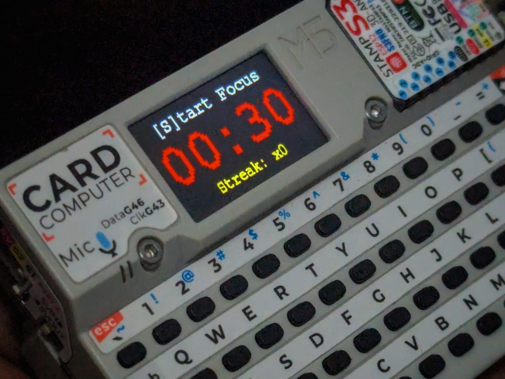

# TomatoClock for M5Cardputer
##### Coded by ChatGPT, DeepSeek & Faisal F Rafat.
A simple Pomodoro timer for the M5Cardputer, featuring customizable focus and break intervals, auto-start functionality, and session tracking. The timer is controlled via keyboard input, with options to start, pause, reset, adjust durations, and toggle auto-start. Designed to help boost productivity and manage time efficiently using the Pomodoro technique.

